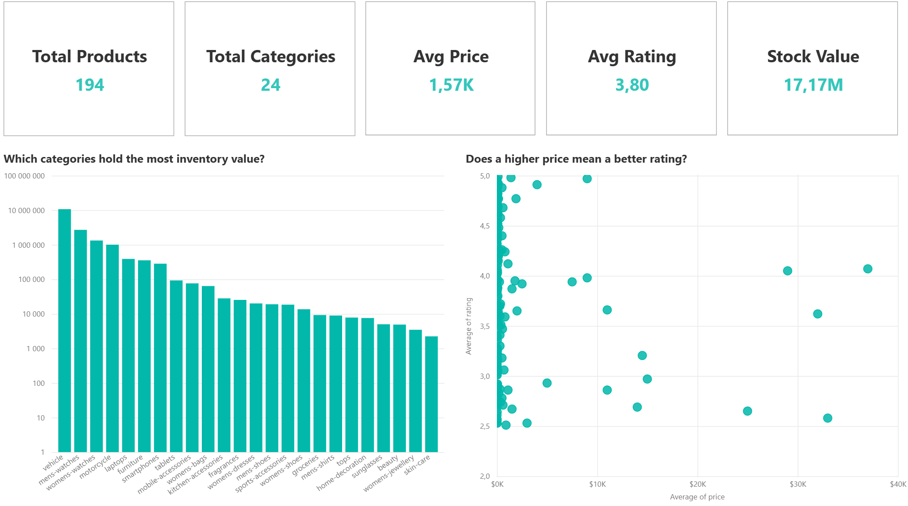
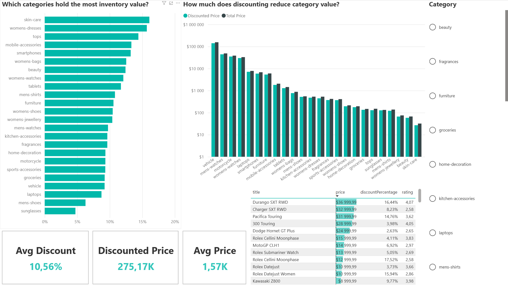
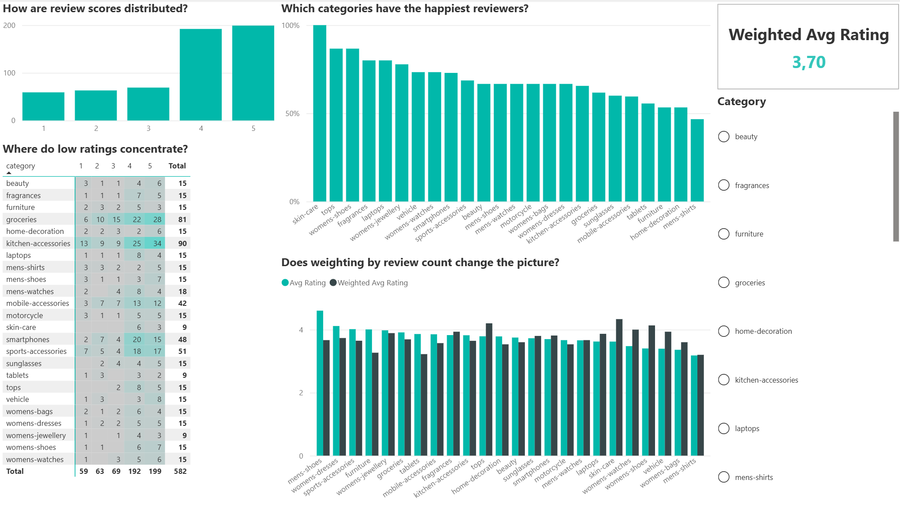

# Products Analytics - Power BI

Interactive analytical report built on the PostgreSQL database produced by the [ETL pipeline](../README.md). Explores product catalog, pricing, and review data across 24 categories and 194 products.

## Setup

This report connects to the pipeline's PostgreSQL database. Before refreshing:
1. Open the report in Power BI Desktop
2. In **Transform Data → Manage Parameters**, set `ServerAddress` to your PostgreSQL host (e.g. `localhost` or your machine's IP)
3. Refresh

## Data Model

Star schema with `public products` as the central fact table:
- `dim_category` (dimension) → filters products by category
- `public products` (1) → (*) `public reviews`, `public images`, `public tags` via `product_id`
- All relationships are single-direction (cross-filter flows from dimensions to facts), avoiding ambiguity in a multi-fact model

## Report pages

### Overview

KPI cards, inventory value per category (log scale), and a price-vs-rating scatter.

### Pricing & Discounts

Average discount per category, discounted vs. total price, and a top/bottom product table with a category slicer.

### Ratings

Score distribution, a category × score heatmap, % positive reviews, and weighted vs. plain average rating.

## Key DAX measures

- **Stock Value** - total inventory value via `SUMX(stock × price)`
- **% of Stock Value** - category share of the total, using `CALCULATE` + `ALL` to break filter context in the denominator
- **Category Rank by Rating** - `RANKX` over all categories by average rating
- **% Positive Reviews** - share of 4–5 star reviews via `CALCULATE` with a filter argument
- **Weighted Avg Rating** - rating weighted by review count, more robust to small-sample categories

## Data quality findings

Data was profiled in SQL before building the report. Key findings that shaped the design:
- **Review dates are unusable** - all reviews share the same millisecond timestamp (generated by dummyjson), so no time-based analysis (trends, moving averages) was built.
- **`brand` is 47% NULL** (92/194) - excluded from analysis; NULLs replaced with "Unknown" to avoid blank slicers.
- **Categories are well-distributed** (24 categories, 3–30 products each) - used as the primary analytical axis.

## Key insights

- Vehicles hold ~62% of total inventory value despite being only 5 products
- Higher price does not correlate with higher rating - expensive products are spread across the rating scale
- Weighting ratings by review count shifts several small-sample categories, showing where averages are unreliable