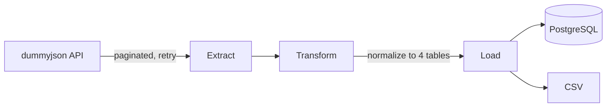

# ETL Pipeline


Python ETL pipeline that extracts product data from a REST API, normalizes the nested JSON into four related tables (products, reviews, images, tags), then loads them into PostgreSQL or CSV.
## Overview

This pipeline fetches ~194 products from the dummyjson API, handling pagination and retrying failed requests with increasing delays. The raw nested JSON is normalized into four related tables (products, reviews, images, tags) using pandas, then loaded into PostgreSQL (running in Docker) or exported to CSV, depending on configuration. Unit tests cover the extraction and transformation logic, and a GitHub Actions workflow runs them on every push.
## Architecture



## Setup

1. Clone and create a virtual environment:
```bash
git clone https://github.com/r4cz3k/etl-pipeline.git
cd etl-pipeline
python3 -m venv .venv
source .venv/bin/activate
```

2. Install dependencies:
```bash
pip install -r requirements.txt
```

3. Start PostgreSQL in Docker:
```bash
docker run --name etl-postgres -e POSTGRES_PASSWORD=yourpassword -p 5432:5432 -d postgres:18
```

4. Create a `.env` file (see `.env.example`):

   *Use the same password in both steps*
```
API_URL=https://dummyjson.com/products
POSTGRES_USER=postgres
POSTGRES_PASSWORD=yourpassword
POSTGRES_HOST=localhost
POSTGRES_PORT=5432
POSTGRES_DB=postgres
SAVE_DESTINATION=DB
```
5. Run the pipeline:
```bash
python main.py
```

## Running tests

```bash
pytest
```